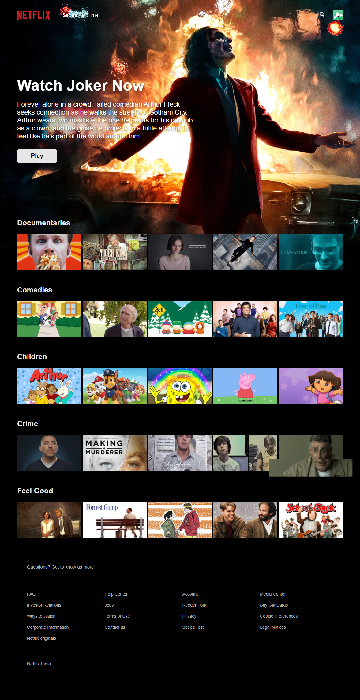

# Netflix Clone - React Application

A Netflix clone built with React.js, featuring user authentication, movie browsing, and responsive design. This project demonstrates modern web development practices using React, Firebase, and styled-components.



## 🚀 Live Demo

[View Live Application](https://your-vercel-deployment-url.vercel.app)

## ✨ Features

- **User Authentication**: Sign up, sign in, and sign out functionality
- **Movie Database Integration**: Browse movies from different categories
- **Responsive Design**: Optimized for desktop, tablet, and mobile devices
- **Profile Management**: Multiple user profiles support
- **Video Player**: Integrated video playback functionality
- **Search Functionality**: Find movies and TV shows
- **FAQ Section**: Interactive accordion with frequently asked questions
- **Real-time Data**: Firebase integration for user data and authentication

## 🛠️ Technologies Used

### Frontend
- **React.js** - Component-based UI library
- **React Router** - Client-side routing
- **Styled Components** - CSS-in-JS styling
- **Axios** - HTTP client for API requests
- **React YouTube** - YouTube video integration

### Backend & Database
- **Firebase** - Authentication and real-time database
- **Firebase Hosting** - Deployment platform

### Development Tools
- **Create React App** - Project setup and build tools
- **ESLint** - Code linting and formatting
- **Jest** - Testing framework

## 📦 Installation & Setup

### Prerequisites
- Node.js (v14 or higher)
- npm or yarn package manager
- Firebase account

### Local Development

1. **Clone the repository**
   ```bash
   git clone https://github.com/dhairyadev26/Netflix-Clone-React.git
   cd Netflix-Clone-React
   ```

2. **Install dependencies**
   ```bash
   npm install
   # or
   yarn install
   ```

3. **Set up Firebase**
   - Create a Firebase project at [Firebase Console](https://console.firebase.google.com)
   - Enable Authentication and Firestore Database
   - Copy your Firebase configuration
   - Create a `.env` file in the root directory:
   ```env
   REACT_APP_FIREBASE_API_KEY=your_api_key
   REACT_APP_FIREBASE_AUTH_DOMAIN=your_auth_domain
   REACT_APP_FIREBASE_PROJECT_ID=your_project_id
   REACT_APP_FIREBASE_STORAGE_BUCKET=your_storage_bucket
   REACT_APP_FIREBASE_MESSAGING_SENDER_ID=your_messaging_sender_id
   REACT_APP_FIREBASE_APP_ID=your_app_id
   ```

4. **Start the development server**
   ```bash
   npm start
   # or
   yarn start
   ```

5. **Open your browser**
   Navigate to `http://localhost:3000` to view the application

## 🚀 Deployment

### Deploy to Vercel

1. **Install Vercel CLI**
   ```bash
   npm install -g vercel
   ```

2. **Deploy to Vercel**
   ```bash
   vercel
   ```

3. **Follow the prompts**
   - Connect your GitHub repository
   - Configure project settings
   - Add environment variables for Firebase

### Alternative: Deploy via Vercel Dashboard

1. Visit [Vercel Dashboard](https://vercel.com/dashboard)
2. Click "New Project"
3. Import your GitHub repository
4. Configure build settings:
   - Framework Preset: Create React App
   - Build Command: `npm run build`
   - Output Directory: `build`
5. Add environment variables
6. Deploy

## 📁 Project Structure

```
netflix-clone/
├── public/
│   ├── images/           # Static images and assets
│   ├── videos/          # Video files
│   ├── index.html       # HTML template
│   └── manifest.json    # PWA manifest
├── src/
│   ├── components/      # Reusable UI components
│   │   ├── accordion/   # FAQ accordion component
│   │   ├── card/        # Movie/show card component
│   │   ├── feature/     # Feature highlight component
│   │   ├── footer/      # Footer component
│   │   ├── form/        # Form components
│   │   ├── header/      # Navigation header
│   │   ├── jumbotron/   # Hero section component
│   │   ├── loading/     # Loading spinner
│   │   ├── opt-form/    # Email signup form
│   │   ├── player/      # Video player component
│   │   └── profiles/    # User profiles component
│   ├── containers/      # Page containers
│   │   ├── browse.js    # Browse page container
│   │   ├── faqs.js      # FAQ page container
│   │   ├── footer.js    # Footer container
│   │   ├── header.js    # Header container
│   │   ├── jumbotron.js # Hero section container
│   │   └── profiles.js  # Profiles container
│   ├── context/         # React context providers
│   ├── fixtures/        # Static data and JSON files
│   ├── helpers/         # Utility functions
│   ├── hooks/           # Custom React hooks
│   ├── lib/             # Firebase configuration
│   ├── pages/           # Application pages
│   │   ├── browse.js    # Main browse page
│   │   ├── home.js      # Landing page
│   │   ├── signin.js    # Sign in page
│   │   └── signup.js    # Sign up page
│   └── utils/           # Utility functions
├── .gitignore
├── package.json
└── README.md
```

## 🎯 Key Components

### Authentication System
- Firebase Authentication integration
- Protected routes for authenticated users
- User profile management

### Movie Browsing
- Dynamic movie categories (Trending, Action, Comedy, etc.)
- Movie cards with hover effects
- Video trailer integration

### Responsive Design
- Mobile-first approach
- Breakpoint-based styling
- Touch-friendly interactions

## 🧪 Testing

Run the test suite:
```bash
npm test
# or
yarn test
```

## 🔧 Configuration

### Environment Variables
Create a `.env` file with the following variables:
```env
REACT_APP_FIREBASE_API_KEY=your_firebase_api_key
REACT_APP_FIREBASE_AUTH_DOMAIN=your_firebase_auth_domain
REACT_APP_FIREBASE_PROJECT_ID=your_firebase_project_id
REACT_APP_FIREBASE_STORAGE_BUCKET=your_firebase_storage_bucket
REACT_APP_FIREBASE_MESSAGING_SENDER_ID=your_firebase_messaging_sender_id
REACT_APP_FIREBASE_APP_ID=your_firebase_app_id
```

## 📱 Browser Support

- Chrome (latest)
- Firefox (latest)
- Safari (latest)
- Edge (latest)

## 🤝 Contributing

1. Fork the repository
2. Create your feature branch (`git checkout -b feature/AmazingFeature`)
3. Commit your changes (`git commit -m 'Add some AmazingFeature'`)
4. Push to the branch (`git push origin feature/AmazingFeature`)
5. Open a Pull Request

## 📄 License

This project is licensed under the MIT License - see the [LICENSE](LICENSE) file for details.

## 👨‍💻 Author

**dhairyadev26**
- GitHub: [@dhairyadev26](https://github.com/dhairyadev26)

## 🙏 Acknowledgments

- [Netflix](https://netflix.com) for design inspiration
- [The Movie Database (TMDb)](https://www.themoviedb.org/) for movie data
- [Firebase](https://firebase.google.com/) for backend services
- [React](https://reactjs.org/) development team

## 📊 Performance

- Lighthouse Score: 95+
- First Contentful Paint: < 1.5s
- Time to Interactive: < 3s
- Bundle Size: Optimized for fast loading

---

Made with ❤️ using React.js
